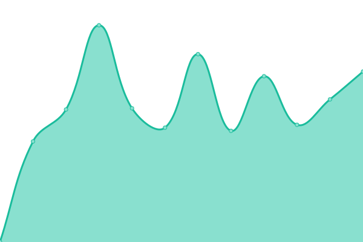

# [📈 Live Status](https://status.snigdhaos.org): <!--live status--> **🟧 Partial outage**

This repository contains the open-source uptime monitor and status page for [Snigdha OS](https://snigdhaos.org/), powered by [Upptime](https://github.com/upptime/upptime).

With [Upptime](https://upptime.js.org), you can get your own unlimited and free uptime monitor and status page, powered entirely by a GitHub repository. We use [Issues](https://github.com/Snigdha-OS/snigdhaos-status/issues) as incident reports, [Actions](https://github.com/Snigdha-OS/snigdhaos-status/actions) as uptime monitors, and [Pages](https://status.snigdhaos.org) for the status page.

<!--start: status pages-->
<!-- This summary is generated by Upptime (https://github.com/upptime/upptime) -->
<!-- Do not edit this manually, your changes will be overwritten -->
<!-- prettier-ignore -->
| URL | Status | History | Response Time | Uptime |
| --- | ------ | ------- | ------------- | ------ |
|  [SNIGDHAOS-CLOUD](https://cloud.snigdhaos.org) | 🟩 Up | [snigdhaos-cloud.yml](https://github.com/Snigdha-OS/snigdhaos-status/commits/HEAD/history/snigdhaos-cloud.yml) | 

 1010ms
     
 | 

<a href="https://Snigdha-OS.github.io/snigdhaos-status/history/snigdhaos-cloud">21.92%</a>
    

|  [SNIGDHAOS-FORUM](https://forum.snigdhaos.org) | 🟩 Up | [snigdhaos-forum.yml](https://github.com/Snigdha-OS/snigdhaos-status/commits/HEAD/history/snigdhaos-forum.yml) | 

 2642ms
     
 | 

<a href="https://Snigdha-OS.github.io/snigdhaos-status/history/snigdhaos-forum">99.73%</a>
    

|  [SNIGDHAOS-TOOLS](https://tools.snigdhaos.org) | 🟥 Down | [snigdhaos-tools.yml](https://github.com/Snigdha-OS/snigdhaos-status/commits/HEAD/history/snigdhaos-tools.yml) | 

 810ms
     
 | 

<a href="https://Snigdha-OS.github.io/snigdhaos-status/history/snigdhaos-tools">20.29%</a>
    

<!--end: status pages-->

[**Visit our status website →**](https://snigdha-os.github.io/snigdhaos-status/)

## 📄 License

- Powered by: [Upptime](https://github.com/upptime/upptime)
- Code: [MIT](./LICENSE) © [Anand Chowdhary](https://anandchowdhary.com), supported by [Pabio](https://pabio.com)
- Data in the `./history` directory: [Open Database License](https://opendatacommons.org/licenses/odbl/1-0/)
