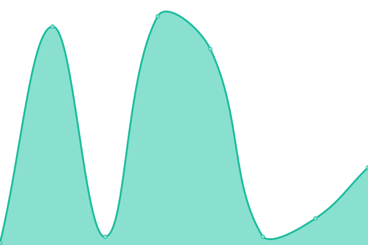
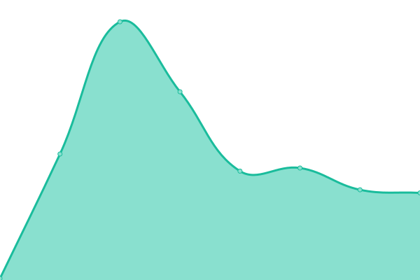
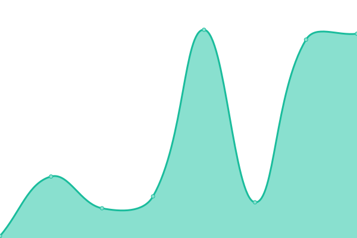

# [📈 Live Status](https://status.snigdhaos.org): <!--live status--> **🟩 All systems operational**

This repository contains the open-source uptime monitor and status page for [Snigdha OS](https://snigdhaos.org/), powered by [Upptime](https://github.com/upptime/upptime).

With [Upptime](https://upptime.js.org), you can get your own unlimited and free uptime monitor and status page, powered entirely by a GitHub repository. We use [Issues](https://github.com/Snigdha-OS/snigdhaos-status/issues) as incident reports, [Actions](https://github.com/Snigdha-OS/snigdhaos-status/actions) as uptime monitors, and [Pages](https://status.snigdhaos.org) for the status page.

<!--start: status pages-->
<!-- This summary is generated by Upptime (https://github.com/upptime/upptime) -->
<!-- Do not edit this manually, your changes will be overwritten -->
<!-- prettier-ignore -->
| URL | Status | History | Response Time | Uptime |
| --- | ------ | ------- | ------------- | ------ |
|  [SNIGDHAOS-ORG](https://snigdhaos.org) | 🟩 Up | [snigdhaos-org.yml](https://github.com/Snigdha-OS/snigdhaos-status/commits/HEAD/history/snigdhaos-org.yml) | 

 1512ms
     
 | 

<a href="https://Snigdha-OS.github.io/snigdhaos-status/history/snigdhaos-org">61.91%</a>
    

|  [SNIGDHAOS-IO](https://snigdha-os.github.io) | 🟩 Up | [snigdhaos-io.yml](https://github.com/Snigdha-OS/snigdhaos-status/commits/HEAD/history/snigdhaos-io.yml) | 

 68ms
     
 | 

<a href="https://Snigdha-OS.github.io/snigdhaos-status/history/snigdhaos-io">100.00%</a>
    

|  [SNIGDHAOS-CLOUD](https://cloud.snigdhaos.org) | 🟩 Up | [snigdhaos-cloud.yml](https://github.com/Snigdha-OS/snigdhaos-status/commits/HEAD/history/snigdhaos-cloud.yml) | 

 1864ms
     
 | 

<a href="https://Snigdha-OS.github.io/snigdhaos-status/history/snigdhaos-cloud">99.85%</a>
    

|  [SNIGDHAOS-FORUM](https://forum.snigdhaos.org) | 🟩 Up | [snigdhaos-forum.yml](https://github.com/Snigdha-OS/snigdhaos-status/commits/HEAD/history/snigdhaos-forum.yml) | 

 1416ms
     
 | 

<a href="https://Snigdha-OS.github.io/snigdhaos-status/history/snigdhaos-forum">100.00%</a>
    

|  [SNIGDHAOS-DOCS](https://snigdhaos.org/documentation/) | 🟩 Up | [snigdhaos-docs.yml](https://github.com/Snigdha-OS/snigdhaos-status/commits/HEAD/history/snigdhaos-docs.yml) | 

 746ms
     
 | 

<a href="https://Snigdha-OS.github.io/snigdhaos-status/history/snigdhaos-docs">100.00%</a>
    

|  [SNIGDHAOS-IODOCS](https://snigdha-os.github.io/documentation/) | 🟩 Up | [snigdhaos-iodocs.yml](https://github.com/Snigdha-OS/snigdhaos-status/commits/HEAD/history/snigdhaos-iodocs.yml) | 

 23ms
     
 | 

<a href="https://Snigdha-OS.github.io/snigdhaos-status/history/snigdhaos-iodocs">100.00%</a>
    

|  [SNIGDHAOS-CORE](https://snosmirror.github.io/snigdhaos-core/) | 🟩 Up | [snigdhaos-core.yml](https://github.com/Snigdha-OS/snigdhaos-status/commits/HEAD/history/snigdhaos-core.yml) | 

 54ms
     
 | 

<a href="https://Snigdha-OS.github.io/snigdhaos-status/history/snigdhaos-core">100.00%</a>
    

|  [SNIGDHAOS-EXTRA](https://snosmirror.github.io/snigdhaos-extra/) | 🟩 Up | [snigdhaos-extra.yml](https://github.com/Snigdha-OS/snigdhaos-status/commits/HEAD/history/snigdhaos-extra.yml) | 

 16ms
     
 | 

<a href="https://Snigdha-OS.github.io/snigdhaos-status/history/snigdhaos-extra">100.00%</a>
    

<!--end: status pages-->

[**Visit our status website →**](https://snigdha-os.github.io/snigdhaos-status/)

## 📄 License

- Powered by: [Upptime](https://github.com/upptime/upptime)
- Code: [MIT](./LICENSE) © [Anand Chowdhary](https://anandchowdhary.com), supported by [Pabio](https://pabio.com)
- Data in the `./history` directory: [Open Database License](https://opendatacommons.org/licenses/odbl/1-0/)
